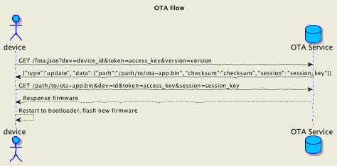

# Ví dụ về ESP8266 NonOS dùng FOTA và Smart Config

## Make file

- Sử dụng makefile từ project mẫu [https://github.com/esp8266vn/esp8266-nonos-sdk-boilerplate](https://github.com/esp8266vn/esp8266-nonos-sdk-boilerplate)
- Ta có thể lấy dự án về từ Github: 

```
git clone https://github.com/esp8266vn/esp8266-nonos-sdk-boilerplate.git
```

## Để Compile project sử dụng lệnh 
```
make  
make flash 
make clean
```

### Flow của OTA



### Tham khảo

- Về FOTA tại [FOTA ESP8266.VN](https://esp8266.vn/nonos-sdk/fota/fota/)
- Về Smart Config tại [Smart Config ESP8266.VN](https://esp8266.vn/nonos-sdk/smartconfig/smartconfig/)
